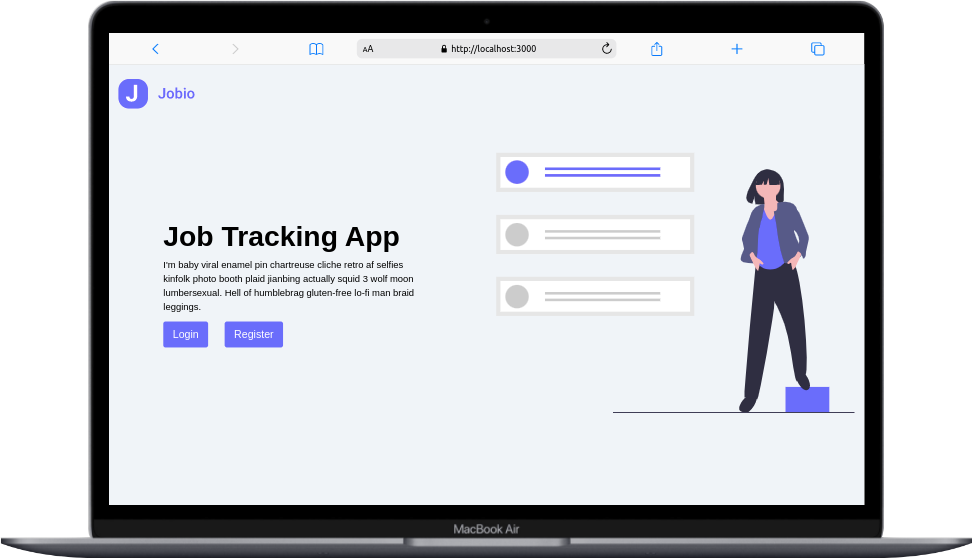
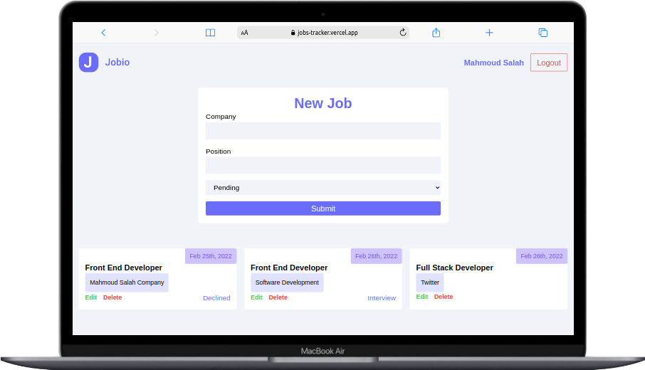
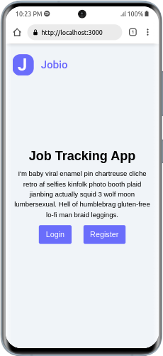
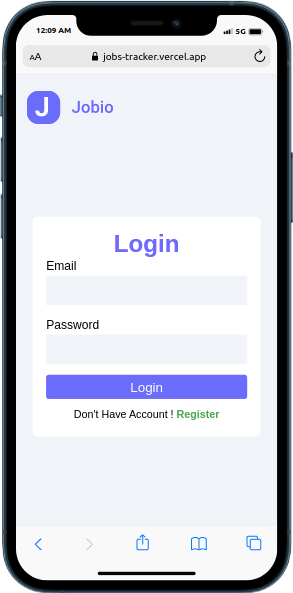
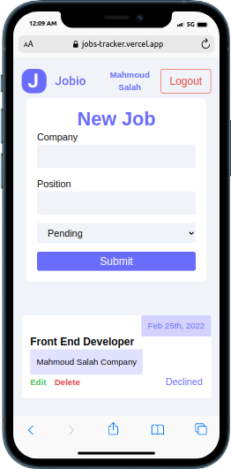

# JOB_TRACKERS

## Fullstack MERN Web Application

## Used Tools

1. Project is bootstrabed with Next.js
2. React Hooks
3. Context Api
4. Tailwindcss and Css Module
5. Mongoo DATABASE
6. Express.js
7. Node.js

## Live Preview

## [job-trackers](https://jobs-tracker.vercel.app/)

### Desktop View

### Mobile View

